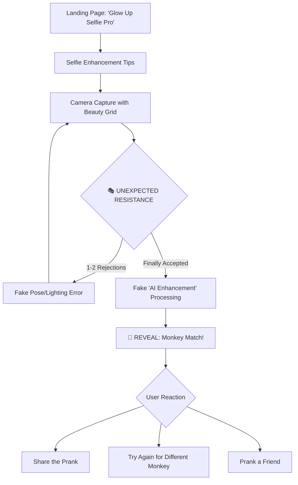
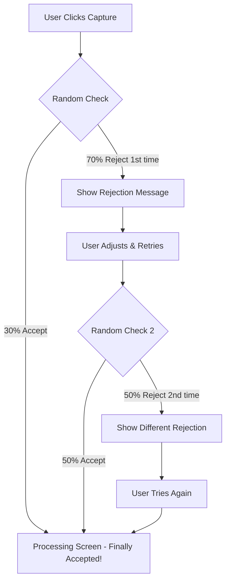
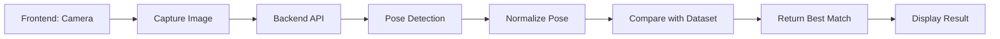
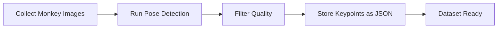

# Product Requirements Document: Monkey Doppelgänger

## Executive Summary

**Monkey Doppelgänger** is a viral-ready **prank web/mobile application** designed as a _bait-and-switch_ experience. The frontend presents itself as a **legitimate selfie enhancement app** – complete with beauty tips, filter options, and professional photography advice. However, when the user takes their "perfect selfie," the app reveals its true purpose: generating a **monkey image in the exact same pose** the user just captured!

**Core Innovation**: Using pose estimation to create a surprising, hilarious twist on the selfie experience. Users expect enhanced selfies but receive their monkey doppelgänger instead.

**The Prank Flow**:
1. 🎭 **The Disguise**: User opens what appears to be "Glow Up Selfie Pro" – a professional selfie enhancement app
2. 📸 **The Setup**: App provides selfie tips, filter previews, and "AI enhancement" promises
3. 🐒 **The Reveal**: After capture, the "processing" reveals their monkey twin instead!

---

## 1. Product Vision & Goals

### Vision
Create a viral prank experience that tricks users into expecting a glamorous selfie enhancement, only to surprise them with their monkey doppelgänger. The app demonstrates real computer vision technology disguised within a seemingly legitimate selfie app shell.

### Primary Goals
- ✅ **Perfect Disguise**: Frontend appears as a legitimate, professional selfie enhancement app
- ✅ **Maximum Surprise**: The monkey reveal should be completely unexpected
- ✅ Deliver instant entertainment value (sub-3 second experience post-capture)
- ✅ Drive viral sharing through humor and the "gotcha" moment
- ✅ Showcase legitimate ML/CV technology in an accessible way
- ✅ Create impressive demo for hackathons/portfolios

### Success Metrics
- **Surprise Factor**: >90% users don't expect the monkey result
- **User Engagement**: >70% share rate (higher due to prank sharing)
- **Performance**: <3s total time from capture to result
- **Believability**: Frontend passes as real selfie app until reveal
- **Technical**: Clean implementation using industry-standard CV libraries

---

## 2. User Experience Flow

> [!IMPORTANT]
> The key to this prank is the **believable disguise**. The frontend must look like a REAL professional selfie app until the reveal moment.

### The Prank User Journey



### Screen Flow Details (The Art of Deception)

#### 1. Welcome/Landing Screen – "Glow Up Selfie Pro" 🌟
> **Disguise Level: 100%** - User believes this is a real selfie app

**Design Elements**:
- **App Name**: "Glow Up Selfie Pro", "AI Beauty Cam", or "Perfect Selfie Studio"
- **Hero Message**: *"Transform your selfies with AI-powered enhancements ✨"*
- **Tagline**: *"Professional-grade beauty filters & pose correction"*
- **Features Listed**:
  - "✨ AI Skin Smoothing"
  - "📐 Perfect Pose Guidance"
  - "🌈 Pro Lighting Adjustment"
  - "💄 Real-time Beauty Filters"
- **CTA Button**: "Start Your Glow Up" or "Take Perfect Selfie"
- **Trust Indicators**: Fake ratings, testimonials, download count

```
┌─────────────────────────────────┐
│    ✨ Glow Up Selfie Pro ✨    │
│                                 │
│   [Hero Image: Beautiful       │
│    enhanced selfie example]    │
│                                 │
│   Transform your selfies with  │
│   AI-powered enhancements      │
│                                 │
│   ⭐ 4.8 rating • 2M downloads │
│                                 │
│   Features:                    │
│   ✨ AI Skin Smoothing          │
│   📐 Perfect Pose Guidance      │
│   🌈 Pro Lighting Adjustment    │
│   💄 Real-time Beauty Filters   │
│                                 │
│   ┌───────────────────────┐    │
│   │  Start Your Glow Up  │    │
│   └───────────────────────┘    │
└─────────────────────────────────┘
```

#### 2. Selfie Tips Screen – "Pre-Shot Coaching" 📸
> **Disguise Level: 100%** - Building trust with "helpful" content

**Content to Display**:
- **Quick Tips Section**:
  - "Find your best angle (slightly above eye level works best)"
  - "Use natural lighting when possible"
  - "Relax your shoulders and jaw"
  - "Try the 'smize' technique (smile with your eyes)"
- **AI Promise**: *"Our AI will analyze your pose and enhance your natural beauty"*
- **CTA**: "I'm Ready!" or "Open Camera"

This screen serves to make the app feel legitimate and helpful before the prank.

#### 3. Camera Capture Screen – "Pro Selfie Mode" 📷
> **Disguise Level: 100%** - Full professional camera UI (hiding the prank)

**UI Elements**:
- **Beauty Grid Overlay**: Rule-of-thirds grid for "professional framing"
- **Filter Preview Strip**: Row of filter thumbnails at bottom (fake - won't apply)
- **Beauty Level Slider**: "Natural ←→ Glam" (fake - does nothing)
- **Enhancement Toggles**:
  - [ON] Skin Smoothing
  - [ON] Eye Brightening  
  - [ON] Face Contouring
  - [ON] Lighting Fix
- **Capture Button**: Stylish, animated shutter button
- **Switch Camera**: Front/back camera toggle
- **Helper Text**: "Hold steady for best AI analysis"

```
┌─────────────────────────────────┐
│  [Switch Cam]     [Settings]   │
├─────────────────────────────────┤
│   ┌─────────────────────────┐   │
│   │                         │   │
│   │    ─ ─ ─ ─ ─ ─ ─ ─    │   │
│   │    │       │       │    │   │
│   │    │ CAMERA│       │    │   │
│   │    │  FEED │       │    │   │
│   │    │       │       │    │   │
│   │    ─ ─ ─ ─ ─ ─ ─ ─    │   │
│   │      BEAUTY GRID       │   │
│   └─────────────────────────┘   │
├─────────────────────────────────┤
│  Beauty: [─────●───] Glam      │
│  [✓Smooth] [✓Eyes] [✓Contour]  │
├─────────────────────────────────┤
│  [Natural] [Warm] [Cool] [Glow]│
│        📷 CAPTURE 📷           │
└─────────────────────────────────┘
```

#### 3.5 🎭 THE UNEXPECTED RESISTANCE – "System Fighting Back"
> **Hackathon Theme**: Creating the unexpected / System resists collapse beautifully

> [!IMPORTANT]
> This is a KEY differentiator! Before accepting the selfie, the app will randomly REJECT 1-2 attempts with fake "pose issues" – building frustration, then relief, making the final monkey reveal even more surprising!

**The Psychology**:
- User works "hard" to get the "perfect" pose
- Builds investment in the outcome
- Creates tension before the prank
- The "earned" result feels more impactful
- System appears "sophisticated" and "picky"

**Rejection Flow**:


**Fake Rejection Messages** (displayed as pop-up overlays):

```javascript
const poseRejectionMessages = [
    // Lighting Related
    {
        title: "⚠️ Lighting Issue Detected",
        message: "Please move to an area with better lighting for optimal AI enhancement.",
        icon: "💡"
    },
    {
        title: "🔆 Shadow Detected",
        message: "Harsh shadows detected on face. Try facing a light source.",
        icon: "☀️"
    },
    
    // Pose Related
    {
        title: "📐 Pose Alignment Required",
        message: "Please center your face in the frame and keep shoulders relaxed.",
        icon: "🧘"
    },
    {
        title: "🔄 Angle Adjustment Needed",
        message: "Tilt your chin slightly down for the perfect angle.",
        icon: "📸"
    },
    {
        title: "👀 Eye Contact Required",
        message: "Look directly at the camera for best results.",
        icon: "👁️"
    },
    
    // Technical-Sounding
    {
        title: "🤖 AI Calibration Error",
        message: "Unable to detect facial landmarks. Please adjust position.",
        icon: "⚙️"
    },
    {
        title: "📊 Quality Check Failed",
        message: "Image clarity below threshold. Hold camera steady.",
        icon: "📷"
    },
    {
        title: "🎯 Focus Required",
        message: "Camera not focused on subject. Tap to refocus and try again.",
        icon: "🔍"
    },
    
    // Funny/Absurd (subtle hints at the prank - optional)
    {
        title: "✨ Aura Not Aligned",
        message: "Your energy seems off. Take a deep breath and try again.",
        icon: "🌟"
    },
    {
        title: "🧬 Bio-metrics Processing",
        message: "Hmm... something's not quite right. One more try!",
        icon: "🔬"
    }
];
```

**Rejection Popup UI**:
```
┌─────────────────────────────────┐
│                                 │
│         ⚠️                      │
│                                 │
│   Pose Alignment Required       │
│                                 │
│   Please center your face in   │
│   the frame and keep shoulders │
│   relaxed.                     │
│                                 │
│   ┌───────────────────────┐    │
│   │     Try Again 📷      │    │
│   └───────────────────────┘    │
│                                 │
│   Attempt 1 of 3               │
└─────────────────────────────────┘
```

**Implementation Logic**:
```javascript
let captureAttempts = 0;
const MAX_REJECTIONS = 2; // Maximum fake rejections before accepting

function shouldRejectCapture() {
    captureAttempts++;
    
    // First attempt: 70% chance of rejection
    if (captureAttempts === 1) {
        return Math.random() < 0.7;
    }
    
    // Second attempt: 50% chance of rejection
    if (captureAttempts === 2) {
        return Math.random() < 0.5;
    }
    
    // Third+ attempt: Always accept (don't frustrate too much!)
    return false;
}

function getRandomRejection() {
    return poseRejectionMessages[
        Math.floor(Math.random() * poseRejectionMessages.length)
    ];
}

async function handleCapture() {
    if (shouldRejectCapture()) {
        const rejection = getRandomRejection();
        showRejectionPopup(rejection);
    } else {
        // Finally "accepted" - proceed to processing
        captureAttempts = 0; // Reset for next session
        await processImage();
    }
}
```

**Why This Works** (Hackathon Theme Alignment):
| Theme Aspect | How We Implement |
|--------------|------------------|
| **Unexpected** | Users expect instant capture, get rejection instead |
| **System Resistance** | App "fights back" before accepting |
| **Beautiful Collapse** | System eventually "gives in" dramatically |
| **Investment** | User effort makes reveal more impactful |
| **Authenticity** | Picky AI = "must be sophisticated!" |

#### 4. "AI Enhancement" Processing Screen – Build the Suspense 🎭
> **Disguise Level: 100%** → **REVEAL: 0%** - This is where the magic happens!

**Phase 1: Fake Beauty Processing (1-2 seconds)**
- **Loading Messages** (legitimate-sounding):
  - "Analyzing facial features..."
  - "Applying skin enhancement..."
  - "Optimizing lighting balance..."
  - "Enhancing natural beauty..."
- **Progress Bar**: Smooth progress to 85%

**Phase 2: The Transition (~1 second)**
- **Loading Messages** (subtle hints - optional):
  - "Cross-referencing beauty database..."
  - "Finding your best look..."
  - "Almost there..."
- **Progress Bar**: Moves to 99%, pauses dramatically

**Phase 3: THE REVEAL! 🐒**
- Brief pause for dramatic effect
- Screen flashes/transitions
- Monkey image appears with celebratory animation!

#### 5. Results Screen – The Big Reveal! 🐒🎉
> **Prank Complete!** - Maximum comedic impact

**Layout**:
```
┌─────────────────────────────────┐
│  🐒 YOUR TRUE GLOW UP! 🐒     │
├─────────────────────────────────┤
│   ┌─────────────────────────┐   │
│   │                         │   │
│   │   [MONKEY IMAGE IN     │   │
│   │    MATCHING POSE]      │   │
│   │                         │   │
│   └─────────────────────────┘   │
│        ↑ Your Selfie Twin!      │
├─────────────────────────────────┤
│   "Scientific" Results:        │
│   📊 Pose Match: 97.3%          │
│   🐵 Species: Curious George    │
│   ✨ Glow Level: MAXIMUM        │
├─────────────────────────────────┤
│  "We found your perfect match!"│
│  "AI enhancement complete 🧬"  │
├─────────────────────────────────┤
│  ┌─────────────┐ ┌───────────┐ │
│  │ 📤 Share    │ │ 🔄 Again  │ │
│  └─────────────┘ └───────────┘ │
│        [👀 Prank a Friend]      │
└─────────────────────────────────┘
```

**Result Elements**:
- **User's Original Selfie**: Small thumbnail (optional, top-left corner)
- **Matched Monkey Image**: Large, prominent display
- **Fake Scientific Metrics**:
  - "Pose Similarity: 97.3%"
  - "Species Match: Curious George"
  - "Glow Score: LEGENDARY"
- **Actions**:
  - **Share** (primary CTA) - "Show everyone your glow up!"
  - **Try Again** - Different poses = different monkeys
  - **Prank a Friend** - Send them to the app

---

## 3. Technical Architecture

### System Overview



### Component Breakdown

#### Frontend Layer
- **Technology**: HTML/CSS/JavaScript (Web) or Flutter (Mobile)
- **Responsibilities**:
  - Camera access and image capture
  - Display loading animations
  - Render results with monkey image
  - Handle sharing functionality

#### Backend Layer
- **Technology**: Python with FastAPI
- **Responsibilities**:
  - Receive image via POST request
  - Perform pose detection
  - Execute matching algorithm
  - Return monkey image + metadata

#### Data Storage
- **Monkey Dataset**: Static JSON file with pose keypoints
- **Images**: File system or CDN
- **No user data persistence** (privacy-first, faster)

---

## 4. Core Technical Implementation

### 4.1 Pose Detection (CRITICAL COMPONENT)

> [!IMPORTANT]
> This is NOT face recognition. We're matching body posture/pose only.

#### Recommended Library: MediaPipe Pose

**Why MediaPipe?**
- ✅ Fast (sub-second inference)
- ✅ Accurate for full-body poses
- ✅ Works on single image
- ✅ Free and open-source
- ✅ Well-documented

**Alternative Options**:
| Library | Speed | Accuracy | Complexity | Best For |
|---------|-------|----------|------------|----------|
| MediaPipe Pose | ⚡⚡⚡ | ⭐⭐⭐ | Low | This project (recommended) |
| MoveNet | ⚡⚡⚡ | ⭐⭐⭐ | Medium | TensorFlow ecosystem |
| OpenPose | ⚡ | ⭐⭐⭐⭐ | High | Research/high accuracy needs |

#### Output Format

MediaPipe returns **33 keypoints** for full body:

```python
# Key landmarks we'll use:
keypoints = {
    0: "nose",
    11: "left_shoulder",
    12: "right_shoulder",
    13: "left_elbow",
    14: "right_elbow",
    15: "left_wrist",
    16: "right_wrist",
    23: "left_hip",
    24: "right_hip",
    25: "left_knee",
    26: "right_knee",
    # ... etc
}
```

Each keypoint has:
- `x`: Horizontal position (0-1 normalized)
- `y`: Vertical position (0-1 normalized)
- `visibility`: Confidence score (0-1)

#### Implementation Code Snippet

```python
import mediapipe as mp
import cv2
import numpy as np

mp_pose = mp.solutions.pose
pose = mp_pose.Pose(static_image_mode=True)

def extract_pose(image_path):
    image = cv2.imread(image_path)
    results = pose.process(cv2.cvtColor(image, cv2.COLOR_BGR2RGB))
    
    if results.pose_landmarks:
        keypoints = []
        for landmark in results.pose_landmarks.landmark:
            keypoints.append([landmark.x, landmark.y])
        return np.array(keypoints)
    return None
```

---

### 4.2 Monkey Pose Dataset

#### Dataset Structure

**Required Size**: 20-50 curated monkey images

**Selection Criteria**:
- Diverse poses (sitting, standing, hanging, reaching, etc.)
- Clear visibility of limbs
- High-quality images
- Various monkey species for variety

#### Pre-processing Pipeline



#### Storage Format

```json
[
  {
    "id": "monkey_001",
    "image": "monkey_001.png",
    "species": "Curious George Vibes",
    "pose": [
      [0.42, 0.18],
      [0.47, 0.22],
      [0.51, 0.28],
      ...
    ],
    "description": "Chillin' pose"
  },
  {
    "id": "monkey_002",
    "image": "monkey_002.png",
    "species": "Thinking Monkey",
    "pose": [...],
    "description": "Contemplative stance"
  }
]
```

#### Dataset Creation Script

```python
def create_monkey_dataset(image_folder):
    dataset = []
    for img_file in os.listdir(image_folder):
        pose = extract_pose(os.path.join(image_folder, img_file))
        if pose is not None:
            dataset.append({
                "id": img_file.split('.')[0],
                "image": img_file,
                "pose": pose.tolist()
            })
    
    with open('monkey_dataset.json', 'w') as f:
        json.dump(dataset, f)
```

---

### 4.3 Pose Normalization (CRITICAL FOR ACCURACY)

> [!WARNING]
> Without normalization, matches will be terrible! People vary in:
> - Height (tall vs short)
> - Distance from camera (near vs far)
> - Rotation (tilted selfies)

#### Normalization Steps

**1. Centering**
```python
def center_pose(keypoints):
    # Use hip center as origin
    left_hip = keypoints[23]
    right_hip = keypoints[24]
    center = (left_hip + right_hip) / 2
    
    # Translate all points
    return keypoints - center
```

**2. Scaling**
```python
def scale_pose(keypoints):
    # Normalize based on shoulder width
    left_shoulder = keypoints[11]
    right_shoulder = keypoints[12]
    shoulder_dist = np.linalg.norm(left_shoulder - right_shoulder)
    
    # Scale so shoulder distance = 1
    return keypoints / shoulder_dist
```

**3. Rotation (Optional)**
```python
def align_pose(keypoints):
    # Rotate so shoulders are horizontal
    left_shoulder = keypoints[11]
    right_shoulder = keypoints[12]
    
    angle = np.arctan2(
        right_shoulder[1] - left_shoulder[1],
        right_shoulder[0] - left_shoulder[0]
    )
    
    rotation_matrix = [
        [np.cos(-angle), -np.sin(-angle)],
        [np.sin(-angle), np.cos(-angle)]
    ]
    
    return keypoints @ rotation_matrix
```

**Complete Normalization Pipeline**
```python
def normalize_pose(keypoints):
    keypoints = center_pose(keypoints)
    keypoints = scale_pose(keypoints)
    keypoints = align_pose(keypoints)  # Optional
    return keypoints
```

---

### 4.4 Pose Matching Algorithm

#### Approach 1: Weighted Euclidean Distance (Recommended)

```python
# Define weights for each keypoint
WEIGHTS = {
    0: 0.1,   # nose (low weight, face doesn't matter)
    11: 1.5,  # left_shoulder (important)
    12: 1.5,  # right_shoulder (important)
    13: 1.3,  # left_elbow (important)
    14: 1.3,  # right_elbow (important)
    15: 1.2,  # left_wrist (important)
    16: 1.2,  # right_wrist (important)
    23: 1.0,  # left_hip
    24: 1.0,  # right_hip
    # ... etc
}

def calculate_similarity(user_pose, monkey_pose):
    total_distance = 0
    total_weight = 0
    
    for i in range(len(user_pose)):
        weight = WEIGHTS.get(i, 0.5)  # Default weight
        distance = np.linalg.norm(user_pose[i] - monkey_pose[i])
        
        total_distance += weight * distance
        total_weight += weight
    
    # Normalize by total weight
    avg_distance = total_distance / total_weight
    
    # Convert to similarity score (0-100)
    similarity = max(0, 100 - (avg_distance * 100))
    
    return similarity
```

#### Approach 2: Cosine Similarity (Alternative)

```python
def cosine_similarity(user_pose, monkey_pose):
    # Flatten poses
    user_flat = user_pose.flatten()
    monkey_flat = monkey_pose.flatten()
    
    # Calculate cosine similarity
    dot_product = np.dot(user_flat, monkey_flat)
    norm_product = np.linalg.norm(user_flat) * np.linalg.norm(monkey_flat)
    
    similarity = (dot_product / norm_product) * 100
    return similarity
```

#### Finding Best Match

```python
def find_best_monkey_match(user_pose, monkey_dataset):
    best_score = -1
    best_match = None
    
    # Normalize user pose
    user_pose_norm = normalize_pose(user_pose)
    
    for monkey in monkey_dataset:
        monkey_pose = np.array(monkey['pose'])
        monkey_pose_norm = normalize_pose(monkey_pose)
        
        score = calculate_similarity(user_pose_norm, monkey_pose_norm)
        
        if score > best_score:
            best_score = score
            best_match = monkey
    
    return best_match, best_score
```

---

### 4.5 Backend API Implementation

#### FastAPI Server

```python
from fastapi import FastAPI, File, UploadFile
from fastapi.responses import JSONResponse
import json

app = FastAPI()

# Load monkey dataset at startup
with open('monkey_dataset.json', 'r') as f:
    MONKEY_DATASET = json.load(f)

@app.post("/analyze")
async def analyze_pose(image: UploadFile = File(...)):
    # Save uploaded image temporarily
    temp_path = f"temp_{image.filename}"
    with open(temp_path, "wb") as f:
        f.write(await image.read())
    
    # Extract pose from user image
    user_pose = extract_pose(temp_path)
    
    if user_pose is None:
        return JSONResponse(
            status_code=400,
            content={"error": "No pose detected. Please take a full-body selfie."}
        )
    
    # Find best matching monkey
    best_match, score = find_best_monkey_match(user_pose, MONKEY_DATASET)
    
    # Add fake precision to score
    fake_score = round(score + np.random.uniform(-2, 5), 1)
    fake_score = min(99.9, max(85.0, fake_score))  # Keep in realistic range
    
    return {
        "monkey_image": best_match['image'],
        "monkey_id": best_match['id'],
        "species": best_match.get('species', 'Mystery Monkey'),
        "confidence": fake_score,
        "match_quality": "REMARKABLE" if fake_score > 95 else "STRONG"
    }

@app.get("/health")
async def health_check():
    return {"status": "ok", "monkeys_loaded": len(MONKEY_DATASET)}
```

---

## 5. Frontend Implementation – The Disguise

> [!IMPORTANT]
> The frontend must look like a **legitimate selfie enhancement app** until the reveal. This is critical for the prank to work!

### Option 1: Web App (Recommended for Speed)

#### Tech Stack
- **HTML5**: Structure
- **Vanilla CSS**: Styling with beauty app aesthetics
- **JavaScript**: Camera API + API calls
- **No framework needed** (keeps it lightweight)

### The "Glow Up Selfie Pro" App Design

#### Color Palette (Beauty App Vibes)
```css
:root {
  --primary-pink: #FF6B9D;
  --secondary-purple: #C44DFF;
  --accent-gold: #FFD700;
  --bg-dark: #1A1A2E;
  --bg-gradient: linear-gradient(135deg, #FF6B9D 0%, #C44DFF 100%);
  --text-light: #FFFFFF;
  --glass-bg: rgba(255, 255, 255, 0.15);
}
```

#### Complete HTML Structure

```html
<!DOCTYPE html>
<html lang="en">
<head>
    <meta charset="UTF-8">
    <meta name="viewport" content="width=device-width, initial-scale=1.0">
    <title>Glow Up Selfie Pro ✨ | AI Beauty Enhancement</title>
    <link href="https://fonts.googleapis.com/css2?family=Poppins:wght@300;400;500;600;700&display=swap" rel="stylesheet">
    <style>
        * {
            margin: 0;
            padding: 0;
            box-sizing: border-box;
        }
        
        body {
            font-family: 'Poppins', sans-serif;
            background: linear-gradient(135deg, #1A1A2E 0%, #16213E 100%);
            min-height: 100vh;
            color: white;
        }
        
        .container {
            max-width: 430px;
            margin: 0 auto;
            padding: 20px;
        }
        
        /* Landing Screen Styles */
        .landing-screen {
            text-align: center;
            padding: 40px 20px;
        }
        
        .app-logo {
            font-size: 3rem;
            margin-bottom: 10px;
        }
        
        .app-title {
            font-size: 1.8rem;
            font-weight: 700;
            background: linear-gradient(90deg, #FF6B9D, #C44DFF);
            -webkit-background-clip: text;
            -webkit-text-fill-color: transparent;
            margin-bottom: 5px;
        }
        
        .app-tagline {
            color: rgba(255,255,255,0.7);
            font-size: 0.9rem;
            margin-bottom: 30px;
        }
        
        .hero-image {
            width: 200px;
            height: 200px;
            border-radius: 50%;
            margin: 20px auto;
            background: linear-gradient(135deg, #FF6B9D, #C44DFF);
            display: flex;
            align-items: center;
            justify-content: center;
            font-size: 5rem;
            box-shadow: 0 20px 60px rgba(255, 107, 157, 0.4);
        }
        
        .features-list {
            text-align: left;
            margin: 30px 0;
            padding: 20px;
            background: rgba(255,255,255,0.05);
            border-radius: 16px;
        }
        
        .feature-item {
            display: flex;
            align-items: center;
            gap: 12px;
            padding: 12px 0;
            border-bottom: 1px solid rgba(255,255,255,0.1);
        }
        
        .feature-item:last-child {
            border-bottom: none;
        }
        
        .feature-icon {
            font-size: 1.5rem;
        }
        
        .trust-badges {
            display: flex;
            justify-content: center;
            gap: 20px;
            margin: 20px 0;
            font-size: 0.85rem;
            color: rgba(255,255,255,0.6);
        }
        
        .cta-button {
            width: 100%;
            padding: 18px 40px;
            font-size: 1.1rem;
            font-weight: 600;
            border: none;
            border-radius: 50px;
            background: linear-gradient(90deg, #FF6B9D, #C44DFF);
            color: white;
            cursor: pointer;
            box-shadow: 0 10px 40px rgba(255, 107, 157, 0.4);
            transition: transform 0.3s, box-shadow 0.3s;
        }
        
        .cta-button:hover {
            transform: translateY(-2px);
            box-shadow: 0 15px 50px rgba(255, 107, 157, 0.5);
        }
        
        /* Tips Screen Styles */
        .tips-screen {
            display: none;
            text-align: center;
            padding: 20px;
        }
        
        .tips-title {
            font-size: 1.5rem;
            margin-bottom: 20px;
        }
        
        .tips-list {
            text-align: left;
            background: rgba(255,255,255,0.05);
            border-radius: 16px;
            padding: 20px;
            margin-bottom: 30px;
        }
        
        .tip-item {
            display: flex;
            gap: 12px;
            padding: 15px 0;
            border-bottom: 1px solid rgba(255,255,255,0.1);
        }
        
        .tip-number {
            width: 24px;
            height: 24px;
            background: linear-gradient(90deg, #FF6B9D, #C44DFF);
            border-radius: 50%;
            display: flex;
            align-items: center;
            justify-content: center;
            font-size: 0.8rem;
            flex-shrink: 0;
        }
        
        /* Camera Screen Styles */
        .camera-screen {
            display: none;
        }
        
        .camera-header {
            display: flex;
            justify-content: space-between;
            padding: 10px 0;
        }
        
        .camera-container {
            position: relative;
            border-radius: 20px;
            overflow: hidden;
            background: #000;
        }
        
        #camera-feed {
            width: 100%;
            display: block;
        }
        
        .beauty-grid {
            position: absolute;
            top: 0;
            left: 0;
            right: 0;
            bottom: 0;
            pointer-events: none;
        }
        
        .beauty-controls {
            background: rgba(255,255,255,0.05);
            border-radius: 16px;
            padding: 15px;
            margin-top: 15px;
        }
        
        .beauty-slider {
            display: flex;
            align-items: center;
            gap: 10px;
            margin-bottom: 15px;
        }
        
        .beauty-slider label {
            font-size: 0.85rem;
        }
        
        .beauty-slider input[type="range"] {
            flex: 1;
            accent-color: #FF6B9D;
        }
        
        .enhancement-toggles {
            display: flex;
            flex-wrap: wrap;
            gap: 8px;
            margin-bottom: 15px;
        }
        
        .toggle-btn {
            padding: 8px 12px;
            background: rgba(255,255,255,0.1);
            border: 1px solid rgba(255,255,255,0.2);
            border-radius: 20px;
            color: white;
            font-size: 0.8rem;
            cursor: pointer;
        }
        
        .toggle-btn.active {
            background: linear-gradient(90deg, #FF6B9D, #C44DFF);
            border-color: transparent;
        }
        
        .filter-strip {
            display: flex;
            gap: 10px;
            overflow-x: auto;
            padding: 10px 0;
        }
        
        .filter-option {
            width: 50px;
            height: 50px;
            border-radius: 10px;
            background: linear-gradient(135deg, var(--filter-color-1), var(--filter-color-2));
            flex-shrink: 0;
            cursor: pointer;
            border: 2px solid transparent;
        }
        
        .filter-option.selected {
            border-color: #FF6B9D;
        }
        
        .capture-button {
            width: 70px;
            height: 70px;
            border-radius: 50%;
            background: linear-gradient(90deg, #FF6B9D, #C44DFF);
            border: 4px solid white;
            margin: 20px auto;
            display: block;
            cursor: pointer;
            transition: transform 0.2s;
        }
        
        .capture-button:hover {
            transform: scale(1.05);
        }
        
        /* Loading Screen Styles */
        .loading-screen {
            display: none;
            text-align: center;
            padding: 60px 20px;
        }
        
        .loading-spinner {
            width: 80px;
            height: 80px;
            margin: 0 auto 30px;
            border-radius: 50%;
            background: linear-gradient(90deg, #FF6B9D, #C44DFF);
            animation: pulse 1.5s infinite;
        }
        
        @keyframes pulse {
            0%, 100% { transform: scale(1); opacity: 1; }
            50% { transform: scale(1.1); opacity: 0.7; }
        }
        
        .loading-text {
            font-size: 1.1rem;
            margin-bottom: 20px;
        }
        
        .progress-bar {
            width: 100%;
            height: 8px;
            background: rgba(255,255,255,0.2);
            border-radius: 10px;
            overflow: hidden;
        }
        
        .progress-fill {
            height: 100%;
            background: linear-gradient(90deg, #FF6B9D, #C44DFF);
            transition: width 0.3s;
        }
        
        /* Result Screen Styles - The Reveal! */
        .result-screen {
            display: none;
            text-align: center;
            padding: 20px;
        }
        
        .reveal-title {
            font-size: 1.8rem;
            margin-bottom: 20px;
            animation: bounce 0.5s;
        }
        
        @keyframes bounce {
            0%, 100% { transform: translateY(0); }
            50% { transform: translateY(-10px); }
        }
        
        .monkey-result {
            width: 100%;
            max-width: 300px;
            border-radius: 20px;
            margin: 20px auto;
            box-shadow: 0 20px 60px rgba(0,0,0,0.5);
        }
        
        .result-stats {
            background: rgba(255,255,255,0.05);
            border-radius: 16px;
            padding: 20px;
            margin: 20px 0;
        }
        
        .stat-item {
            display: flex;
            justify-content: space-between;
            padding: 10px 0;
            border-bottom: 1px solid rgba(255,255,255,0.1);
        }
        
        .action-buttons {
            display: flex;
            gap: 15px;
            margin-top: 20px;
        }
        
        .action-btn {
            flex: 1;
            padding: 15px;
            border-radius: 50px;
            font-weight: 600;
            cursor: pointer;
            transition: all 0.3s;
        }
        
        .action-btn.primary {
            background: linear-gradient(90deg, #FF6B9D, #C44DFF);
            border: none;
            color: white;
        }
        
        .action-btn.secondary {
            background: transparent;
            border: 2px solid rgba(255,255,255,0.3);
            color: white;
        }
        
        /* 🎭 Rejection Popup Styles (Unexpected Resistance) */
        .rejection-popup {
            position: fixed;
            top: 0;
            left: 0;
            right: 0;
            bottom: 0;
            background: rgba(0,0,0,0.8);
            display: flex;
            align-items: center;
            justify-content: center;
            z-index: 1000;
            animation: fadeIn 0.3s;
        }
        
        @keyframes fadeIn {
            from { opacity: 0; }
            to { opacity: 1; }
        }
        
        .rejection-card {
            background: linear-gradient(135deg, #1A1A2E, #16213E);
            border: 1px solid rgba(255,255,255,0.1);
            border-radius: 24px;
            padding: 40px 30px;
            text-align: center;
            max-width: 320px;
            margin: 20px;
            animation: slideUp 0.3s;
        }
        
        @keyframes slideUp {
            from { transform: translateY(20px); opacity: 0; }
            to { transform: translateY(0); opacity: 1; }
        }
        
        .rejection-icon {
            font-size: 3rem;
            display: block;
            margin-bottom: 15px;
        }
        
        .rejection-title {
            font-size: 1.3rem;
            font-weight: 600;
            margin-bottom: 10px;
            color: #FF6B9D;
        }
        
        .rejection-message {
            font-size: 0.95rem;
            color: rgba(255,255,255,0.7);
            margin-bottom: 25px;
            line-height: 1.5;
        }
        
        .attempt-count {
            font-size: 0.8rem;
            color: rgba(255,255,255,0.4);
            margin-top: 15px;
        }
        
        .hidden { display: none !important; }
    </style>
</head>
<body>
    <div class="container">
        <!-- SCREEN 1: Landing (The Disguise) -->
        <div id="landing-screen" class="landing-screen">
            <div class="app-logo">✨</div>
            <h1 class="app-title">Glow Up Selfie Pro</h1>
            <p class="app-tagline">AI-Powered Beauty Enhancement</p>
            
            <div class="hero-image">📸</div>
            
            <div class="features-list">
                <div class="feature-item">
                    <span class="feature-icon">✨</span>
                    <span>AI Skin Smoothing & Tone Correction</span>
                </div>
                <div class="feature-item">
                    <span class="feature-icon">📐</span>
                    <span>Professional Pose Guidance</span>
                </div>
                <div class="feature-item">
                    <span class="feature-icon">🌈</span>
                    <span>Smart Lighting Optimization</span>
                </div>
                <div class="feature-item">
                    <span class="feature-icon">💄</span>
                    <span>Real-time Beauty Filters</span>
                </div>
            </div>
            
            <div class="trust-badges">
                <span>⭐ 4.9 Rating</span>
                <span>📥 2M+ Downloads</span>
                <span>🏆 Editor's Choice</span>
            </div>
            
            <button class="cta-button" onclick="showTipsScreen()">
                Start Your Glow Up ✨
            </button>
        </div>

        <!-- SCREEN 2: Tips (Building Trust) -->
        <div id="tips-screen" class="tips-screen">
            <h2 class="tips-title">📸 Selfie Pro Tips</h2>
            <p style="color: rgba(255,255,255,0.7); margin-bottom: 20px;">
                Follow these tips for the best AI enhancement results
            </p>
            
            <div class="tips-list">
                <div class="tip-item">
                    <span class="tip-number">1</span>
                    <span>Find your best angle — slightly above eye level works best</span>
                </div>
                <div class="tip-item">
                    <span class="tip-number">2</span>
                    <span>Use natural lighting when possible for authentic results</span>
                </div>
                <div class="tip-item">
                    <span class="tip-number">3</span>
                    <span>Relax your shoulders and jaw for a natural look</span>
                </div>
                <div class="tip-item">
                    <span class="tip-number">4</span>
                    <span>Try the "smize" technique — smile with your eyes!</span>
                </div>
            </div>
            
            <p style="font-size: 0.9rem; color: rgba(255,255,255,0.6); margin-bottom: 20px;">
                Our AI will analyze your pose and enhance your natural beauty ✨
            </p>
            
            <button class="cta-button" onclick="showCameraScreen()">
                I'm Ready! Open Camera 📷
            </button>
        </div>

        <!-- SCREEN 3: Camera (The Setup) -->
        <div id="camera-screen" class="camera-screen">
            <div class="camera-header">
                <button style="background: none; border: none; color: white; font-size: 1.2rem;">🔄</button>
                <span style="font-weight: 600;">Pro Selfie Mode</span>
                <button style="background: none; border: none; color: white; font-size: 1.2rem;">⚙️</button>
            </div>
            
            <div class="camera-container">
                <video id="camera-feed" autoplay playsinline></video>
                <svg class="beauty-grid" viewBox="0 0 100 100" preserveAspectRatio="none">
                    <line x1="33" y1="0" x2="33" y2="100" stroke="rgba(255,255,255,0.3)" stroke-width="0.5"/>
                    <line x1="66" y1="0" x2="66" y2="100" stroke="rgba(255,255,255,0.3)" stroke-width="0.5"/>
                    <line x1="0" y1="33" x2="100" y2="33" stroke="rgba(255,255,255,0.3)" stroke-width="0.5"/>
                    <line x1="0" y1="66" x2="100" y2="66" stroke="rgba(255,255,255,0.3)" stroke-width="0.5"/>
                </svg>
            </div>
            
            <div class="beauty-controls">
                <div class="beauty-slider">
                    <label>Beauty</label>
                    <input type="range" min="0" max="100" value="60">
                    <span>Glam</span>
                </div>
                
                <div class="enhancement-toggles">
                    <button class="toggle-btn active">✓ Smooth</button>
                    <button class="toggle-btn active">✓ Eyes</button>
                    <button class="toggle-btn active">✓ Contour</button>
                    <button class="toggle-btn">Slim</button>
                </div>
                
                <div class="filter-strip">
                    <div class="filter-option selected" style="--filter-color-1: #fff; --filter-color-2: #eee;"></div>
                    <div class="filter-option" style="--filter-color-1: #FFD93D; --filter-color-2: #FF6B6B;"></div>
                    <div class="filter-option" style="--filter-color-1: #6BCB77; --filter-color-2: #4D96FF;"></div>
                    <div class="filter-option" style="--filter-color-1: #C44DFF; --filter-color-2: #FF6B9D;"></div>
                    <div class="filter-option" style="--filter-color-1: #333; --filter-color-2: #555;"></div>
                </div>
            </div>
            
            <button class="capture-button" onclick="captureImage()"></button>
            <p style="text-align: center; font-size: 0.85rem; color: rgba(255,255,255,0.5);">
                Hold steady for best AI analysis
            </p>
        </div>
        
        <canvas id="canvas" style="display:none;"></canvas>

        <!-- 🎭 REJECTION POPUP (Unexpected Resistance) -->
        <div id="rejection-popup" class="rejection-popup" style="display:none;">
            <div class="rejection-card">
                <span id="rejection-icon" class="rejection-icon">⚠️</span>
                <h3 id="rejection-title" class="rejection-title">Pose Issue Detected</h3>
                <p id="rejection-message" class="rejection-message">Please adjust your position.</p>
                <button class="cta-button" onclick="hideRejectionPopup()">
                    Try Again 📷
                </button>
                <p id="attempt-count" class="attempt-count">Attempt 1 of 3</p>
            </div>
        </div>

        <!-- SCREEN 4: Loading (The Suspense) -->
        <div id="loading-screen" class="loading-screen">
            <div class="loading-spinner">✨</div>
            <p id="loading-text" class="loading-text">Analyzing facial features...</p>
            <div class="progress-bar">
                <div id="progress-fill" class="progress-fill" style="width: 0%"></div>
            </div>
        </div>

        <!-- SCREEN 5: Result (THE REVEAL!) -->
        <div id="result-screen" class="result-screen">
            <h2 class="reveal-title">🐒 YOUR TRUE GLOW UP! 🐒</h2>
            
            
            <div class="result-stats">
                <div class="stat-item">
                    <span>📊 Pose Match</span>
                    <span id="pose-score">97.3%</span>
                </div>
                <div class="stat-item">
                    <span>🐵 Species</span>
                    <span id="species-name">Curious George</span>
                </div>
                <div class="stat-item">
                    <span>✨ Glow Level</span>
                    <span id="glow-level">MAXIMUM</span>
                </div>
            </div>
            
            <p style="font-size: 0.95rem; color: rgba(255,255,255,0.7);">
                "AI enhancement complete" 🧬
            </p>
            
            <div class="action-buttons">
                <button class="action-btn primary" onclick="shareResult()">📤 Share</button>
                <button class="action-btn secondary" onclick="tryAgain()">🔄 Again</button>
            </div>
            
            <button style="background: none; border: none; color: #FF6B9D; margin-top: 20px; cursor: pointer;">
                👀 Prank a Friend
            </button>
        </div>
    </div>

    <script src="app.js"></script>
</body>
</html>
```

#### JavaScript Implementation (app.js)

```javascript
// app.js - Glow Up Selfie Pro (The Prank Engine)

const video = document.getElementById('camera-feed');
const canvas = document.getElementById('canvas');

// Screen navigation
function hideAllScreens() {
    document.querySelectorAll('.landing-screen, .tips-screen, .camera-screen, .loading-screen, .result-screen')
        .forEach(screen => screen.style.display = 'none');
}

function showTipsScreen() {
    hideAllScreens();
    document.getElementById('tips-screen').style.display = 'block';
}

function showCameraScreen() {
    hideAllScreens();
    document.getElementById('camera-screen').style.display = 'block';
    startCamera();
}

function showLoadingScreen() {
    hideAllScreens();
    document.getElementById('loading-screen').style.display = 'block';
}

function showResultScreen() {
    hideAllScreens();
    document.getElementById('result-screen').style.display = 'block';
}

// Camera access
async function startCamera() {
    try {
        const stream = await navigator.mediaDevices.getUserMedia({ 
            video: { facingMode: 'user' } 
        });
        video.srcObject = stream;
    } catch (err) {
        alert('Camera access required for the glow up! Please allow camera access.');
    }
}

// Fake beauty loading messages (Phase 1 - The Disguise)
const beautyLoadingMessages = [
    "Analyzing facial features...",
    "Applying skin enhancement...",
    "Optimizing lighting balance...",
    "Enhancing natural beauty...",
    "Cross-referencing beauty database...",
    "Finding your best look...",
    "Almost there..."
];

// ============================================
// 🎭 UNEXPECTED RESISTANCE - Fake Rejections
// ============================================

let captureAttempts = 0;
const MAX_REJECTIONS = 2;

// Fake rejection messages (maintains the beauty app disguise)
const poseRejectionMessages = [
    {
        title: "⚠️ Lighting Issue Detected",
        message: "Please move to an area with better lighting for optimal AI enhancement.",
        icon: "💡"
    },
    {
        title: "📐 Pose Alignment Required",
        message: "Please center your face in the frame and keep shoulders relaxed.",
        icon: "🧘"
    },
    {
        title: "🔄 Angle Adjustment Needed",
        message: "Tilt your chin slightly down for the perfect angle.",
        icon: "📸"
    },
    {
        title: "👀 Eye Contact Required",
        message: "Look directly at the camera for best results.",
        icon: "👁️"
    },
    {
        title: "🤖 AI Calibration Error",
        message: "Unable to detect facial landmarks. Please adjust position.",
        icon: "⚙️"
    },
    {
        title: "📊 Quality Check Failed",
        message: "Image clarity below threshold. Hold camera steady.",
        icon: "📷"
    },
    {
        title: "✨ Aura Not Aligned",
        message: "Your energy seems off. Take a deep breath and try again.",
        icon: "🌟"
    }
];

function shouldRejectCapture() {
    captureAttempts++;
    
    // First attempt: 70% chance of rejection
    if (captureAttempts === 1) {
        return Math.random() < 0.7;
    }
    
    // Second attempt: 50% chance of rejection
    if (captureAttempts === 2) {
        return Math.random() < 0.5;
    }
    
    // Third+ attempt: Always accept (don't frustrate too much!)
    return false;
}

function getRandomRejection() {
    return poseRejectionMessages[
        Math.floor(Math.random() * poseRejectionMessages.length)
    ];
}

function showRejectionPopup(rejection) {
    const popup = document.getElementById('rejection-popup');
    const title = document.getElementById('rejection-title');
    const message = document.getElementById('rejection-message');
    const icon = document.getElementById('rejection-icon');
    const attempts = document.getElementById('attempt-count');
    
    icon.textContent = rejection.icon;
    title.textContent = rejection.title;
    message.textContent = rejection.message;
    attempts.textContent = `Attempt ${captureAttempts} of 3`;
    
    popup.style.display = 'flex';
}

function hideRejectionPopup() {
    document.getElementById('rejection-popup').style.display = 'none';
}

// Main capture handler with rejection logic
async function captureImage() {
    // 🎭 THE UNEXPECTED RESISTANCE
    if (shouldRejectCapture()) {
        const rejection = getRandomRejection();
        showRejectionPopup(rejection);
        return; // Don't proceed - make them try again!
    }
    
    // Reset attempts for next session
    captureAttempts = 0;
    
    // Draw video frame to canvas
    canvas.width = video.videoWidth;
    canvas.height = video.videoHeight;
    canvas.getContext('2d').drawImage(video, 0, 0);
    
    // Show loading screen
    showLoadingScreen();
    
    // Convert to blob and send to backend
    canvas.toBlob(async (blob) => {
        const formData = new FormData();
        formData.append('image', blob, 'selfie.jpg');
        
        // Start fake progress animation
        fakeProgressAnimation();
        
        try {
            const response = await fetch('http://localhost:8000/analyze', {
                method: 'POST',
                body: formData
            });
            
            const result = await response.json();
            
            // Wait for dramatic effect, then reveal!
            setTimeout(() => {
                revealMonkey(result);
            }, 2500); // Total loading time ~3 seconds
            
        } catch (error) {
            // Even on error, show a random monkey for laughs
            setTimeout(() => {
                revealMonkey({
                    monkey_image: 'default_monkey.png',
                    species: 'Mystery Monkey',
                    confidence: 95.7,
                    match_quality: 'LEGENDARY'
                });
            }, 2500);
        }
    });
}

// Fake progress bar animation
function fakeProgressAnimation() {
    const progressFill = document.getElementById('progress-fill');
    const loadingText = document.getElementById('loading-text');
    
    let progress = 0;
    let messageIndex = 0;
    
    const interval = setInterval(() => {
        // Update progress
        progress += Math.random() * 15;
        
        if (progress > 99) {
            progress = 99; // Dramatic pause at 99%!
            clearInterval(interval);
        }
        
        progressFill.style.width = progress + '%';
        
        // Cycle through loading messages
        if (progress > (messageIndex + 1) * 14) {
            messageIndex = Math.min(messageIndex + 1, beautyLoadingMessages.length - 1);
            loadingText.textContent = beautyLoadingMessages[messageIndex];
        }
    }, 150);
}

// THE BIG REVEAL! 🐒
function revealMonkey(data) {
    // Update result screen with monkey data
    document.getElementById('monkey-img').src = `monkeys/${data.monkey_image}`;
    document.getElementById('pose-score').textContent = data.confidence + '%';
    document.getElementById('species-name').textContent = data.species;
    document.getElementById('glow-level').textContent = data.match_quality;
    
    // Show result screen with fanfare!
    showResultScreen();
    
    // Optional: Play reveal sound
    // playRevealSound();
}

// Try again - reset to camera
function tryAgain() {
    showCameraScreen();
}

// Share functionality
async function shareResult() {
    const monkeyImg = document.getElementById('monkey-img');
    const score = document.getElementById('pose-score').textContent;
    const species = document.getElementById('species-name').textContent;
    
    if (navigator.share) {
        try {
            await navigator.share({
                title: 'My Glow Up Result! 🐒',
                text: `I'm ${score} ${species}! Get your glow up at:`,
                url: window.location.href
            });
        } catch (err) {
            console.log('Share cancelled');
        }
    } else {
        // Fallback: copy link
        navigator.clipboard.writeText(window.location.href);
        alert('Link copied! Share your glow up with friends 🐒');
    }
}

// Toggle enhancement buttons (fake - for show only)
document.querySelectorAll('.toggle-btn').forEach(btn => {
    btn.addEventListener('click', () => {
        btn.classList.toggle('active');
        btn.textContent = btn.classList.contains('active') 
            ? '✓ ' + btn.textContent.replace('✓ ', '')
            : btn.textContent.replace('✓ ', '');
    });
});

// Filter selection (fake - for show only)
document.querySelectorAll('.filter-option').forEach(filter => {
    filter.addEventListener('click', () => {
        document.querySelectorAll('.filter-option').forEach(f => f.classList.remove('selected'));
        filter.classList.add('selected');
    });
});

### Option 2: Mobile App (Flutter)

> [!TIP]
> Use Flutter if you want native mobile features like better camera control, haptic feedback, and app store distribution.

```dart
// Simplified Flutter camera capture
import 'package:camera/camera.dart';
import 'package:http/http.dart' as http;

class MonkeyMatcherPage extends StatefulWidget {
  @override
  _MonkeyMatcherPageState createState() => _MonkeyMatcherPageState();
}

class _MonkeyMatcherPageState extends State<MonkeyMatcherPage> {
  CameraController? controller;
  
  Future<void> captureAndAnalyze() async {
    final image = await controller!.takePicture();
    
    // Show loading
    setState(() { isLoading = true; });
    
    // Upload to backend
    var request = http.MultipartRequest(
      'POST',
      Uri.parse('https://your-api.com/analyze')
    );
    request.files.add(await http.MultipartFile.fromPath('image', image.path));
    
    var response = await request.send();
    var result = await response.stream.bytesToString();
    
    // Parse and show result
    showResultScreen(jsonDecode(result));
  }
}
```

---

## 6. UX Enhancements – Perfecting the Prank

### 6.1 Maintaining the Disguise

> [!IMPORTANT]
> The loading messages must maintain the "beauty app" illusion until the reveal. NO monkey-related messages until the result screen!

#### Phase 1: Beauty App Loading Messages (Pre-Reveal)

```javascript
// These messages maintain the selfie app disguise
const beautyLoadingMessages = [
    "Analyzing facial features...",
    "Detecting skin tone...",
    "Applying AI enhancement...",
    "Optimizing lighting balance...",
    "Enhancing natural beauty...",
    "Processing beauty filters...",
    "Perfecting your glow...",
    "Almost there..."
];
```

#### Phase 2: The Surprise Transition

```javascript
// Brief moment before reveal
const transitionMessages = [
    "Finding your best look...",
    "Cross-referencing beauty database...",
    "Finalizing your glow up..."
];
```

#### Progress Bar Trick

```javascript
function fakeProgressBar() {
    let progress = 0;
    const interval = setInterval(() => {
        progress += Math.random() * 20;
        if (progress >= 99) {
            progress = 99;  // Stuck at 99%!
            clearInterval(interval);
            // Wait 500ms at 99% for dramatic effect
            setTimeout(showResult, 500);
        }
        updateProgressBar(progress);
    }, 100);
}
```

### 6.2 Audio Effects (Optional but Recommended)

```html
<audio id="drumroll" src="drumroll.mp3"></audio>
<audio id="tada" src="tada.mp3"></audio>

<script>
function playDramaTicReveal() {
    document.getElementById('drumroll').play();
    setTimeout(() => {
        document.getElementById('tada').play();
        showMonkeyResult();
    }, 2000);
}
</script>
```

### 6.3 Result Screen Variations

Create multiple caption templates for replayability:

```javascript
const captions = [
    {
        title: "Scientific Result: {score}% posture match 🐒",
        subtitle: "Your monkey twin: {species}",
        footer: "Pose similarity: REMARKABLE"
    },
    {
        title: "BREAKING: {score}% DNA match found! 🧬",
        subtitle: "You're basically a {species}",
        footer: "Certified by Monkey Science Institute"
    },
    {
        title: "Analysis Complete: {score}% confident",
        subtitle: "Spirit animal detected: {species}",
        footer: "This is your true form 🐵"
    }
];
```

### 6.4 Share Functionality

```javascript
async function shareResult(monkeyImage, score, species) {
    // Create combo image (user + monkey)
    const canvas = document.createElement('canvas');
    const ctx = canvas.getContext('2d');
    
    // ... draw user selfie + monkey + text ...
    
    const blob = await canvas.toBlob();
    
    if (navigator.share) {
        // Native sharing (mobile)
        await navigator.share({
            title: 'My Monkey Doppelgänger!',
            text: `I'm ${score}% ${species}! Find your monkey match:`,
            files: [new File([blob], 'my-monkey-twin.png')]
        });
    } else {
        // Fallback: download button
        downloadImage(blob);
    }
}
```

---

## 7. Technology Stack Summary

### Recommended Stack (Web App)

| Layer | Technology | Justification |
|-------|------------|---------------|
| **Frontend** | HTML/CSS/JavaScript | Fastest development, universal compatibility |
| **Backend** | Python + FastAPI | Best ML library support, fast API framework |
| **Pose Detection** | MediaPipe Pose | Fast, accurate, free, well-documented |
| **Image Processing** | OpenCV + NumPy | Industry standard, powerful |
| **Deployment** | Frontend: Vercel/Netlify<br>Backend: Railway/Render | Free tier, easy deployment |
| **Dataset Storage** | Static JSON + local images | Simple, no DB needed |

### Alternative Stack (Mobile App)

| Layer | Technology |
|-------|------------|
| **Frontend** | Flutter |
| **Backend** | Same (Python + FastAPI) |
| **Camera** | Flutter camera plugin |

### Development Tools

```bash
# Python dependencies
pip install fastapi uvicorn mediapipe opencv-python numpy python-multipart

# Optional: Image enhancement
pip install pillow

# Optional: Testing
pip install pytest httpx
```

---

## 8. Implementation Roadmap

### Phase 1: MVP (2-3 days)

- [x] **Day 1: Backend Core**
  - Set up FastAPI server
  - Implement pose detection with MediaPipe
  - Create normalization functions
  - Build matching algorithm

- [x] **Day 2: Dataset + Frontend**
  - Collect 20-30 monkey images
  - Pre-process monkey poses
  - Build basic web frontend with camera
  - Connect frontend to backend

- [x] **Day 3: Polish**
  - Add fake loading animations
  - Implement share functionality
  - Style results screen
  - Test end-to-end flow

### Phase 2: Enhancement (1-2 days)

- [ ] Add audio effects
- [ ] Create multiple result templates
- [ ] Optimize performance
- [ ] Add error handling (no pose detected, etc.)
- [ ] Mobile responsiveness

### Phase 3: Viral Features (Optional)

- [ ] Leaderboard (most accurate matches)
- [ ] GIF monkey instead of static image
- [ ] Multiple monkey matches (top 3)
- [ ] Social media integration
- [ ] Analytics tracking

---

## 9. Deployment Strategy

### Backend Deployment (Railway Recommended)

```dockerfile
# Dockerfile
FROM python:3.9-slim

WORKDIR /app

# Install dependencies
COPY requirements.txt .
RUN pip install --no-cache-dir -r requirements.txt

# Copy app files
COPY . .

# Expose port
EXPOSE 8000

# Run server
CMD ["uvicorn", "main:app", "--host", "0.0.0.0", "--port", "8000"]
```

### Frontend Deployment (Vercel)

```json
// vercel.json
{
  "buildCommand": null,
  "outputDirectory": ".",
  "framework": null
}
```

Simply push to GitHub and connect to Vercel - done!

---

## 10. Success Criteria & KPIs

### Technical Metrics

| Metric | Target | Measurement |
|--------|--------|-------------|
| **Response Time** | < 3 seconds | Time from capture to result |
| **Pose Detection Accuracy** | > 90% | % of images with detected pose |
| **Match Quality** | Visually believable | Manual QA review |
| **Uptime** | > 99% | Server monitoring |

### User Engagement Metrics

| Metric | Target |
|--------|--------|
| **Share Rate** | > 50% of users share result |
| **Retry Rate** | > 30% take multiple selfies |
| **Average Session Time** | 2-3 minutes |
| **Virality Coefficient** | > 1.2 (each user brings 1.2 more) |

### Hackathon Presentation Metrics

- ✅ **Live Demo Success**: Works on first try
- ✅ **Audience Laughter**: Result is funny
- ✅ **Technical Depth Questions**: Judges ask about ML implementation
- ✅ **"Can I Try It?" Requests**: Judges want to use it

---

## 11. Potential Challenges & Solutions

### Challenge 1: Poor Pose Detection

**Problem**: User too close/far, bad lighting, partial body

**Solutions**:
- Add framing guide on camera screen
- Provide example "good pose" image
- Add error message: "Please step back and show full body"
- Use MediaPipe's confidence scores to filter bad detections

### Challenge 2: No Good Monkey Matches

**Problem**: User pose very unique, no similar monkey

**Solutions**:
- Ensure diverse monkey dataset (20+ poses)
- Set minimum confidence threshold (always show something)
- Add "consolation" matches for edge cases
- Use weighted algorithm to prioritize upper body (more visible in selfies)

### Challenge 3: Performance Issues

**Problem**: Slow pose detection on large images

**Solutions**:
```python
# Resize image before processing
def resize_for_processing(image, max_width=640):
    height, width = image.shape[:2]
    if width > max_width:
        ratio = max_width / width
        new_size = (max_width, int(height * ratio))
        return cv2.resize(image, new_size)
    return image
```

### Challenge 4: Dataset Copyright Issues

**Problem**: Can't use random monkey images legally

**Solutions**:
- Use royalty-free stock photos (Unsplash, Pexels)
- Generate synthetic monkey poses with AI (DALL-E, Midjourney)
- Commission original illustrations
- Use Creative Commons licensed images with attribution

---

## 12. Future Enhancements

### Advanced Features (Post-MVP)

1. **Pose Embeddings with ML**
   - Train a small neural network to create pose embeddings
   - Better matching than Euclidean distance
   - Requires: TensorFlow/PyTorch, training data

2. **Animated Results**
   - Show GIF of monkey instead of static image
   - Side-by-side pose animation
   - Requires: GIF library, larger dataset

3. **Multi-Monkey Matches**
   - Show top 3 matches instead of just one
   - "You're 40% Gibbon, 30% Orangutan, 30% Chimp"
   - Better entertainment value

4. **Pose Clustering**
   - Group similar monkey poses
   - Faster search (O(log n) instead of O(n))
   - Requires: scikit-learn, K-means clustering

5. **Social Features**
   - User leaderboard (highest confidence scores)
   - Gallery of all matched pairs
   - Commenting system
   - Requires: Database (PostgreSQL), authentication

---

## 13. Why This Impresses Judges

### Technical Sophistication ✅
- **Real Computer Vision**: Not a toy app, uses industry-standard libraries
- **Clear ML Pipeline**: Pose detection → normalization → matching
- **Smart Architecture**: Proper separation of concerns, scalable design

### Execution Quality ✅
- **Polished UX**: Smooth animations, great visual design
- **Performance**: Fast response times, optimized processing
- **Error Handling**: Graceful degradation, helpful error messages

### Innovation ✅
- **Novel Application**: Pose matching for entertainment (not common)
- **Accessible ML**: Makes CV technology approachable and fun
- **Viral Potential**: Built for sharing, demonstrates product thinking

### Demo-ability ✅
- **Live Demo Ready**: Works instantly, no setup required
- **Participatory**: Judges can try it themselves
- **Memorable**: They'll remember "the monkey app"

---

## 14. Quick Start Guide

### For Developers

```bash
# 1. Clone starter template (you'll create this)
git clone https://github.com/yourusername/monkey-doppelganger.git
cd monkey-doppelganger

# 2. Set up backend
cd backend
pip install -r requirements.txt
python create_monkey_dataset.py  # Pre-process monkey images
uvicorn main:app --reload

# 3. Set up frontend (in new terminal)
cd ../frontend
# Open index.html in browser, or:
python -m http.server 8080

# 4. Test
# Navigate to http://localhost:8080
# Take a selfie
# See your monkey match!
```

### For Non-Technical Users

1. Visit: `https://monkey-match.vercel.app` (your deployed URL)
2. Click "Start"
3. Allow camera access
4. Strike a pose 🧘
5. See your monkey twin! 🐒
6. Share on social media

---

## 15. Appendix

### A. Sample Monkey Dataset Structure

```
project/
├── backend/
│   ├── main.py                 # FastAPI server
│   ├── pose_detection.py       # MediaPipe logic
│   ├── matching.py             # Algorithm implementation
│   ├── monkey_dataset.json     # Pre-processed poses
│   └── requirements.txt
├── frontend/
│   ├── index.html
│   ├── styles.css
│   ├── app.js
│   └── assets/
│       ├── monkeys/            # Monkey images
│       │   ├── monkey_001.png
│       │   ├── monkey_002.png
│       │   └── ...
│       └── sounds/
│           ├── drumroll.mp3
│           └── tada.mp3
└── README.md
```

### B. Key Dependencies

```txt
# requirements.txt
fastapi==0.104.1
uvicorn[standard]==0.24.0
mediapipe==0.10.8
opencv-python==4.8.1.78
numpy==1.26.2
python-multipart==0.0.6
pillow==10.1.0
```

### C. Useful Resources

- [MediaPipe Pose Documentation](https://google.github.io/mediapipe/solutions/pose.html)
- [FastAPI Tutorial](https://fastapi.tiangolo.com/tutorial/)
- [Web Camera API Guide](https://developer.mozilla.org/en-US/docs/Web/API/MediaDevices/getUserMedia)
- [Royalty-Free Monkey Images](https://unsplash.com/s/photos/monkey)

---

## Conclusion

**Monkey Doppelgänger** (disguised as "Glow Up Selfie Pro") combines legitimate computer vision technology with a clever prank UX to create a memorable, viral experience. By presenting itself as a genuine beauty enhancement app before the monkey reveal, we maximize surprise and shareability.

**The Prank Formula**:
1. 🎭 **Believable Disguise** – Professional selfie app UI builds trust
2. 📸 **Genuine Expectation** – Users truly expect enhanced selfies
3. 🐒 **Hilarious Reveal** – Monkey pose match creates the "gotcha" moment
4. 📤 **Viral Sharing** – Friends want to prank each other too

**Key Success Factors**:
1. ✅ Perfect disguise (frontend looks like real beauty app)
2. ✅ Maximum surprise (unexpected monkey reveal)
3. ✅ Fast, polished user experience (<3 seconds post-capture)
4. ✅ Technically sound (real pose detection, smart matching)
5. ✅ Highly shareable (prank your friends!)
6. ✅ Demo-ready (works live, participatory)

The implementation combines real ML/CV expertise with excellent prank engineering. MediaPipe and FastAPI make this achievable in a hackathon timeline while the disguised UI creates a truly memorable experience.

Now go build it and prank everyone! 🐒✨

